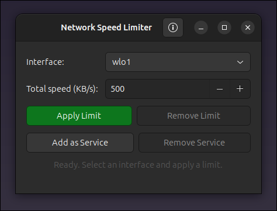

# Linux Network Speed Limiter


A tool to limit combined upload and download speeds on a specific network interface (e.g., `wlo1`) with a total bandwidth cap in **KB/s** (kiloBytes per second). Ships in two forms:

- **`speed_limit_gui`** — a GTK3 graphical app (recommended)
- **`speed_limit`** — the original command-line tool

## Screenshot

<p align="center">
  
</p>

## Features

- Limit combined upload + download speed (e.g., 500 KB/s total = 250 KB/s up + 250 KB/s down)
- Real-time traffic shaping using Linux `tc` (traffic control)
- Works on Wi-Fi, Ethernet, or any Linux network interface
- Root privileges required

### GUI features (`speed_limit_gui`)

- **Interface switcher** — pick any interface from a dropdown; the one currently
  carrying the default route (the connection in use) is pre-selected automatically.
- **Apply / Remove** buttons with a live status readout.
- **Add as Service / Remove Service** — install a systemd unit
  (`/etc/systemd/system/speed-limit.service`) that reapplies the selected limit
  automatically every time the machine boots. The service is enabled and started
  immediately; "Remove Service" disables and deletes it. (Requires root and
  systemd.)
- **About dialog** (ⓘ in the header bar).
- Installs a desktop launcher and app icon, so it shows up in your application
  menu and the window/taskbar.

### CLI features (`speed_limit`)

- Automatic cleanup on Ctrl+C.
- **Service mode** — install/remove a systemd service so the limit is reapplied
  automatically at every boot (same unit the GUI uses):

  ```bash
  sudo speed_limit add-service 500   # install + enable + start (500 KB/s)
  sudo speed_limit remove-service    # disable + remove
  ```

## The GUI

### Build & install

```bash
make                 # builds speed_limit_gui and speed_limit
sudo make install    # installs binaries, icon, launcher and .desktop entry
```

`sudo make install` places:

| File | Destination |
|------|-------------|
| `speed_limit_gui`, `speed_limit` | `/usr/local/bin/` |
| `speed-limit-launcher` | `/usr/local/bin/` |
| `speed-limit.svg` (app icon) | `/usr/share/icons/hicolor/scalable/apps/` |
| `speed-limit.desktop` | `/usr/share/applications/` |

To remove everything again:

```bash
sudo make uninstall
```

### Running the GUI

Launch **Network Speed Limiter** from your application menu, or from a terminal:

```bash
sudo speed_limit_gui
```

The menu entry runs `speed-limit-launcher`, which elevates privileges with
`pkexec` while forwarding your X display so the window appears correctly. (`tc`
requires root, hence the password prompt.)

### Prerequisites

- GTK 3 development libraries (`libgtk-3-dev` on Debian/Ubuntu, `gtk3-devel` on Fedora)
- `iproute2` (provides `tc`) — see below
- `polkit` (`pkexec`) for the menu launcher

## Prerequisites

### System Requirements
- Linux operating system
- Root access (sudo)
- Network interface name (e.g., `wlo1`, `eth0`, `enp0s3`)

### Required Packages

Install `iproute2` (includes `tc` traffic control utility):

```bash
# Debian/Ubuntu
sudo apt update
sudo apt install iproute2

# Red Hat/CentOS/Fedora
sudo yum install iproute2
# or
sudo dnf install iproute2

# Arch Linux
sudo pacman -S iproute2
```

### Verify Installation

Check if `tc` is available:

```bash
which tc
tc -V  # Should show version info
```

## Command-line tool (`speed_limit`)

```bash
make
```

This builds both executables, including the CLI tool `speed_limit`.

To remove the compiled binaries:

```bash
make clean
```

(Install/uninstall is shared with the GUI — see [The GUI](#the-gui) above.)

## Usage (CLI)

### Basic Command

```bash
sudo ./speed_limit <total_speed_in_KB_per_sec>
```

### Examples

```bash
# Limit total speed to 500 KB/s (250 KB/s up + 250 KB/s down)
sudo ./speed_limit 500

# Limit total speed to 1024 KB/s (1 MB/s total = 512 KB/s each direction)
sudo ./speed_limit 1024

# Limit total speed to 100 KB/s (very slow - good for testing)
sudo ./speed_limit 100
```

### Run as a service (start automatically at boot)

```bash
# Install: writes /etc/systemd/system/speed-limit.service, enables and starts it
sudo ./speed_limit add-service 500

# Remove: disables and deletes the service
sudo ./speed_limit remove-service
```

The CLI service uses interface `wlo1` (the value of `IFACE` in `speed_limit.c`).
The unit is shared with the GUI, so a service installed from one tool is shown
and managed by the other.

### Expected Output

```
Limiting wlo1:
  Upload:   250 KB/s (2000 kbps)
  Download: 250 KB/s (2000 kbps)
  Combined: 500 KB/s

✓ Speed limit active successfully!
Press Ctrl+C to remove limit and exit.
```

## Stopping the Limit

### Method 1: Graceful Shutdown (Recommended)

Press `Ctrl+C` while the script is running. This will automatically remove all traffic control rules and exit.

### Method 2: Manual Removal

If the script crashes or you need to remove limits manually:

```bash
# Remove upload limiter (root qdisc)
sudo tc qdisc del dev wlo1 root

# Remove download limiter (ingress qdisc)
sudo tc qdisc del dev wlo1 ingress
```

### Method 3: Remove All Rules for an Interface

To completely reset the interface (removes ALL traffic control rules):

```bash
sudo tc qdisc del dev wlo1 root 2>/dev/null
sudo tc qdisc del dev wlo1 ingress 2>/dev/null
```

## Viewing Active Limits

### Check Upload Limiter (Egress)

```bash
# Show qdisc configuration
tc qdisc show dev wlo1

# Show detailed class hierarchy
tc class show dev wlo1

# Show filters
tc filter show dev wlo1
```

**Expected output example:**
```
qdisc htb 1: root refcnt 2 r2q 10 default 10 direct_packets_stat 0
qdisc ingress ffff: parent ffff:fff1 ----------------
```

### Check Download Limiter (Ingress) with Statistics

```bash
# Show ingress qdisc with packet statistics
tc -s qdisc show dev wlo1 ingress
```

**Example output:**
```
qdisc ingress ffff: parent ffff:fff1 ----------------
 Sent 1234567 bytes 1234 pkt (dropped 0, overlimits 0)
```

- `dropped` = packets dropped by the limiter (should increase when speed exceeds limit)
- `overlimits` = times the rate was exceeded

### Check Both Limiters with Statistics

```bash
# Full statistics for all qdiscs
tc -s qdisc show dev wlo1
```

## Monitoring Real-Time Speeds

### Method 1: iftop (Recommended)

Install and run:

```bash
# Install iftop
sudo apt install iftop  # Debian/Ubuntu
sudo yum install iftop  # Red Hat/CentOS

# Monitor wlo1 interface
sudo iftop -i wlo1
```

**Controls in iftop:**
- `t` - Toggle display of total traffic
- `p` - Toggle port display
- `n` - Toggle hostname resolution (press for faster display)
- `q` - Quit

### Method 2: nethogs (Shows per-process)

```bash
# Install nethogs
sudo apt install nethogs  # Debian/Ubuntu
sudo yum install nethogs  # Red Hat/CentOS

# Monitor wlo1
sudo nethogs wlo1
```

### Method 3: vnstat (Lightweight daemon)

```bash
# Install vnstat
sudo apt install vnstat

# Monitor live traffic
vnstat -l -i wlo1
```

### Method 4: Simple /proc/net/dev (Quick check)

```bash
# Watch real-time traffic (updates every 1 second)
watch -n 1 'cat /proc/net/dev | grep wlo1'
```

## Testing the Speed Limit

### Test Download Speed

```bash
# Download a file and monitor speed
curl -o /dev/null http://speedtest.tele2.net/100MB.zip

# Or use wget
wget -O /dev/null http://speedtest.tele2.net/100MB.zip
```

### Test Upload Speed

```bash
# Upload to a test server (requires server endpoint)
# Or use iperf3
iperf3 -c iperf.he.net -p 5201 -u -b 250K -t 10
```

### Verify Combined Limit

Run upload and download simultaneously:

```bash
# Terminal 1: Download test
curl -o /dev/null http://speedtest.tele2.net/100MB.zip

# Terminal 2: Upload test (using scp to somewhere)
scp largefile.txt user@remote:/dev/null
```

## Troubleshooting

### Bug: Limit not working

**Check if rules are applied:**
```bash
tc qdisc show dev wlo1
```

**Check if interface name is correct:**
```bash
ip link show
# Find your active interface (usually wlo1, wlan0, eth0, enp0s3)
```

**Verify `tc` is installed:**
```bash
which tc
tc -V
```

### Bug: Script crashes and limit remains

**Manually remove all rules:**
```bash
sudo tc qdisc del dev wlo1 root
sudo tc qdisc del dev wlo1 ingress
```

**Reset interface completely (last resort):**
```bash
sudo ip link set wlo1 down
sudo ip link set wlo1 up
```

### Bug: Speeds not accurate

The ingress policer drops packets instead of buffering them, which may cause slightly inaccurate download limiting. For better accuracy:

1. Increase the burst size (modify `burst_bytes` in the C code)
2. Use a more sophisticated setup with `ifb` (Intermediate Functional Block) device

### Error: "RTNETLINK answers: No such file or directory"

This means the qdisc doesn't exist. It's normal the first time you run the script. The fixed version ignores this error.

### Error: "RTNETLINK answers: Operation not permitted"

You must run the script with `sudo` (root privileges).

## Changing Network Interface

If your interface isn't `wlo1` (e.g., `eth0`, `enp0s3`, `wlan0`), edit the C source:

```c
#define IFACE "wlo1"   // Change this to your interface name
```

Then recompile:

```bash
make
```

## Customizing the Upload/Download Split

By default, the total speed is split 50/50 between upload and download. To change this ratio, modify the C code:

```c
int upload_ratio = 30;   // 30% for upload
int download_ratio = 70; // 70% for download

int upload_kb = (total_kb * upload_ratio) / 100;
int download_kb = (total_kb * download_ratio) / 100;
```

## Performance Notes

- **CPU Usage**: Minimal (<1% CPU) when idle, slightly higher under heavy traffic
- **Accuracy**: Upload limiting is very accurate (±2%). Download limiting may burst slightly due to ingress policing
- **Memory**: No significant memory usage
- **Compatibility**: Works on all Linux distributions with `tc` (kernel 2.6+)

## Uninstall

Remove the compiled binary:

```bash
make clean
```

If you installed system-wide:

```bash
sudo make uninstall
```

No system files are modified (only temporary `tc` rules that disappear on reboot).

## Example Workflow

```bash
# 1. Compile
make

# 2. Limit internet to 500 KB/s total
sudo ./speed_limit 500

# 3. In another terminal, monitor speed
sudo iftop -i wlo1

# 4. Test download
curl -o /dev/null http://speedtest.tele2.net/100MB.zip

# 5. Press Ctrl+C in the first terminal to remove limit
```

## Author

Jean-Francois Lachance-Caumartin

## License

Free to use and modify (MIT).

## Support

For issues:
1. Check that `tc` is installed (`tc -V`)
2. Verify interface name (`ip link show`)
3. Run with `sudo`
4. Check system logs: `dmesg | tail`
```
